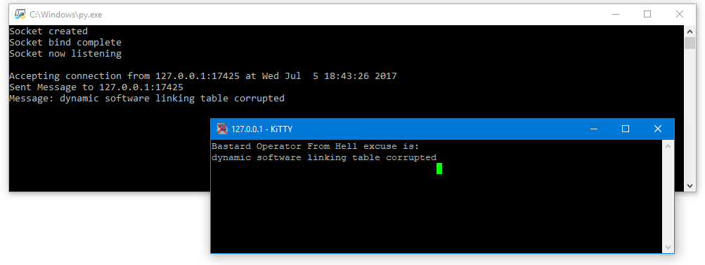

# BOFH Firewall
### Description
Bastard Operator From Hell Firewall can send message to online port scanners, like: Shodan scanners, raw port scanners, port analyzers.  
You can redirect some ports or all ports to the BOFH Firewall by using iptables rules.  
Default IP: 127.0.0.1  
Default Port: 8080

### Features:
- IPv4, IPv6 compatibility
- Listen to a specific port
- Can customize excuses.txt

### Built on:
- Python 3
- Notepad++

### Tested on:
Windows 10 v1703 (build 15063)  
Raspberry Pi 3

### Screenshots
Testing on Kitty by using Raw connection:  
  
Results:  
  

### Contact
Twitter: [@RomelSan](http://www.twitter.com/RomelSan)    
Date: July 5, 2017

### License
MIT
